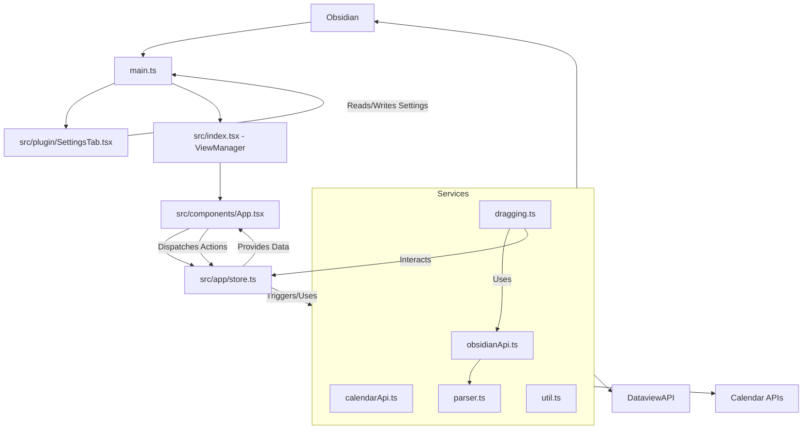
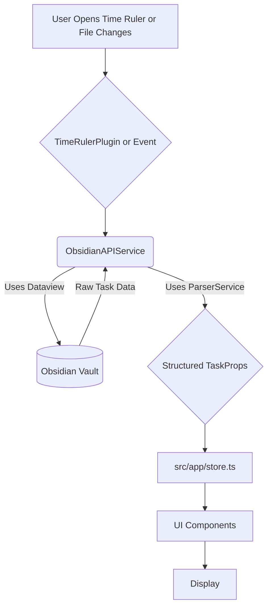

# Architecture

The Time Ruler plugin follows a modular architecture, primarily built around the Obsidian plugin lifecycle, React for its UI, and a set of services for backend logic.

## Core Components

1.  **`main.ts` (Plugin Entry Point)**
    *   **`TimeRulerPlugin` Class:** Extends `Plugin` from the Obsidian API.
    *   **Lifecycle Management:** Handles `onload` and `onunload` methods.
        *   `onload()`: Loads settings, registers the custom view (`TimeRulerView`), adds the settings tab (`SettingsTab`), registers commands (e.g., open view, find task), sets up ribbon icons, and integrates with the editor menu.
    *   **Settings Management:** Loads and saves plugin settings (`TimeRulerSettings`).
    *   **View Activation:** Contains logic to open and manage the `TimeRulerView` leaf.
    *   **Dataview Dependency Check:** Ensures the Dataview plugin is active.

2.  **`src/index.tsx` & `src/components/App.tsx` (Main UI View)**
    *   **`TimeRulerView` Class:** (Likely defined in `index.tsx` or a similar top-level React file) Extends `ItemView` from Obsidian, providing the main panel for the Time Ruler. This class is responsible for mounting and unmounting the React application.
    *   **React Root (`App.tsx`):** The main React component that renders the entire Time Ruler interface (timeline, tasks, buttons, etc.).
    *   **State Management:** Interacts with the global store (`src/app/store.ts`) to get data and dispatch actions.

3.  **`src/plugin/SettingsTab.tsx` (Settings UI)**
    *   **`SettingsTab` Class:** Extends `PluginSettingTab`.
    *   Uses React (`Calendars` component) to render the settings interface.
    *   Provides UI elements (toggles, dropdowns, text fields) for all plugin settings.
    *   Saves changes directly to `plugin.settings` and calls `plugin.saveSettings()`.

4.  **`src/app/store.ts` (State Management)**
    *   Likely uses a state management solution (custom or a small library like Zustand or Valtio, given the `getters` and `setters` pattern).
    *   **State:** Holds application-wide data:
        *   Parsed tasks (`TaskProps[]`)
        *   Calendar events (`EventProps[]`)
        *   UI state (e.g., current view mode, selected dates, drag state)
        *   Plugin settings (a copy for reactivity)
        *   References to core APIs (Obsidian API, Calendar API).
    *   **Getters:** Functions to retrieve data from the store.
    *   **Setters/Actions:** Functions to update the store's state.

5.  **`src/services/` (Backend Logic)**

    *   **`obsidianApi.ts` (`ObsidianAPI` Class):**
        *   Handles all direct interactions with the Obsidian vault and Dataview.
        *   **Task CRUD:** Reading tasks (using Dataview queries), creating new tasks, updating existing tasks (modifying Markdown files), and deleting tasks.
        *   **File System:** Reading, writing, and creating Markdown files. Finding appropriate insertion points for new tasks.
        *   **Dataview Queries:** Constructs and executes Dataview queries based on settings and context.
        *   **Metadata Parsing:** Relies on `parser.ts` to convert text to structured task data and vice-versa.
        *   Manages the order of files/headings in the UI.
        *   Handles daily note logic (finding/creating daily notes, using templates).

    *   **`calendarApi.ts` (`CalendarAPI` Class):**
        *   Fetches and parses iCalendar (`.ics`) feeds from URLs provided in settings.
        *   Uses `ical` library for parsing.
        *   Handles recurring events, exceptions, and timezones.
        *   Stores fetched events in the global state.

    *   **`parser.ts` (Data Parsing and Formatting):**
        *   **`textToTask()`:** Converts raw text lines from Markdown files into structured `TaskProps` objects. This is a critical and complex function that detects various task formats (Dataview, Tasks plugin, Day Planner, etc.) and extracts metadata (scheduled, due, priority, duration, etc.).
        *   **`pageToTask()`:** Converts Dataview `Page` objects (entire notes as tasks) into `TaskProps`.
        *   **`taskToText()`:** Converts `TaskProps` objects back into their string representation for saving to Markdown files, respecting the original or preferred format.
        *   **`taskToPage()`:** Updates a page's frontmatter from `TaskProps`.
        *   `detectFieldFormat()`: Determines the metadata syntax used in a task string.

    *   **`dragging.ts` (Drag and Drop Logic):**
        *   Contains event handlers (`onDragStart`, `onDragEnd`) for `@dnd-kit/core`.
        *   Manages the state of a drag operation (what's being dragged).
        *   Determines the action to take based on what was dragged and where it was dropped (e.g., reschedule task, change duration, create new task, delete task, move task).
        *   Dispatches actions to update task data (usually via `setters.patchTasks` or by interacting with `obsidianApi.ts`).

    *   **`util.ts` (Utility Functions):**
        *   Contains helper functions for date/time manipulation (using Luxon), string operations, path parsing, DOM interactions (scrolling), etc., used across different services and components.

    *   **`autoScroll.ts`:**
        *   Likely handles automatic scrolling of the timeline view when dragging tasks near the edges of the visible area.

6.  **`src/components/` (React Components)**
    *   Contains all the individual React components that make up the Time Ruler UI.
    *   Examples: `Task.tsx`, `Day.tsx`, `Hours.tsx`, `Timer.tsx`, `Button.tsx`, etc.
    *   These components are responsible for rendering tasks, time slots, calendar events, and UI controls. They fetch data from the store and dispatch actions on user interaction.

## Data Flow (Example: Rescheduling a Task)

1.  **User Interaction:** User drags a task in the `TimeRulerView` (React UI).
2.  **Drag Event:** `@dnd-kit/core` captures the drag events. `dragging.ts` (`onDragEnd`) handles the drop.
3.  **Action Dispatch:** `dragging.ts` determines it's a reschedule action. It calls a setter function from `src/app/store.ts` (e.g., `setters.patchTasks([taskId], { scheduled: newTime })`).
4.  **State Update (Optimistic):** The store updates the task's `scheduled` property. React components subscribed to this part of the store re-render to reflect the change immediately in the UI.
5.  **Side Effect (Saving):** The `patchTasks` setter (or a listener/effect tied to it) likely triggers a call to `obsidianApi.saveTask()`.
6.  **File Modification:** `obsidianApi.ts` reads the relevant Markdown file, uses `parser.ts` (`taskToText`) to convert the updated `TaskProps` back to its string representation, and writes the changes to the file using the Obsidian API.
7.  **Dataview Update:** Dataview detects the file change and updates its index.
8.  **Data Refresh (Optional):** The plugin might re-fetch tasks for the modified file via `obsidianApi.loadTasks()` if needed, though often the optimistic update is sufficient, and Dataview events handle external changes.

## Diagrams (Mermaid MD)

### High-Level Component Diagram

### Simplified Data Flow for Task Loading

