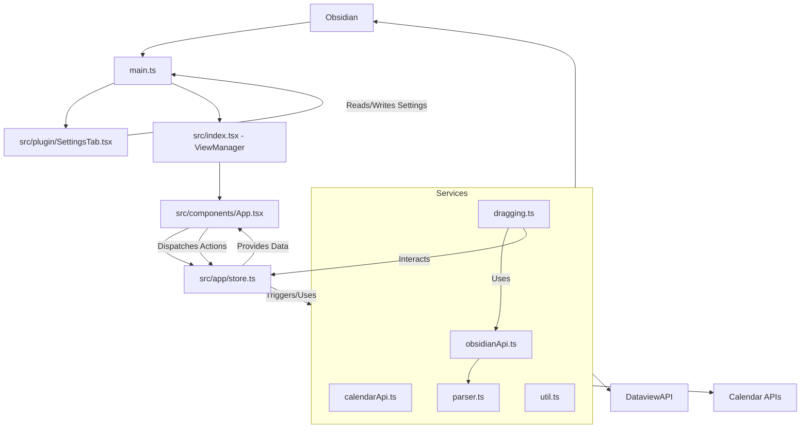
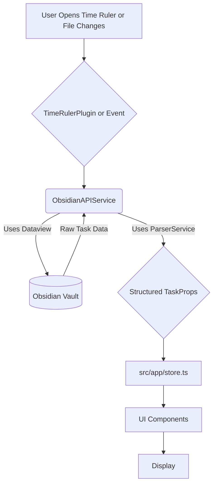

# Architecture

The Time Ruler plugin follows a modular architecture, primarily built around the Obsidian plugin lifecycle, React for its UI (using Preact through an alias), Zustand for state management, and a set of services for backend logic and interactions with Obsidian.

## Core Components

1.  **`src/main.ts` (Plugin Entry Point)**
    *   **`TimeRulerPlugin` Class:** Extends `Plugin` from the Obsidian API. This is the main class that Obsidian loads and interacts with.
    *   **Lifecycle Management:**
        *   `onload()`: Initializes the plugin. This includes:
            *   Loading plugin settings (`loadSettings()`).
            *   Registering the custom view (`TimeRulerView` via `registerView()`).
            *   Adding the settings tab (`SettingsTab`).
            *   Registering various commands using `addCommand()`:
                *   `activate-view`: Open Time Ruler.
                *   `activate-view-main`: Open Time Ruler in a main tab.
                *   `activate-view-sidebar`: Open Time Ruler in the sidebar.
                *   `find-task`: Reveal a task from the editor in Time Ruler.
            *   Adding a ribbon icon to open the Time Ruler.
            *   Registering an event listener for `editor-menu` to add context menu items (e.g., "Reveal in Time Ruler", "Do Today/Tomorrow/Now/Next Week", "Unschedule").
        *   `onunload()`: (Implicitly via Obsidian) Cleans up resources, though not explicitly detailed in `main.ts` beyond what Obsidian handles.
    *   **Settings Management:**
        *   `TimeRulerSettings`: Defines the structure for plugin settings, with `DEFAULT_SETTINGS`.
        *   `loadSettings()`: Loads settings from Obsidian's storage.
        *   `saveSettings()`: Saves current settings to Obsidian's storage. This method is passed to `SettingsTab` and `ObsidianAPI` to allow them to persist settings changes.
    *   **View Activation (`activateView()`):**
        *   Checks if the Dataview plugin is enabled, as it's a critical dependency.
        *   Detaches any existing Time Ruler views to ensure a clean state.
        *   Creates a new leaf (either in the main workspace or sidebar based on settings/command) and sets its view state to `TIME_RULER_VIEW`.
    *   **Task Interaction (`jumpToTask()`, `editTask()`):**
        *   `jumpToTask()`: Locates a task in the Time Ruler view based on the current editor context (file and line number).
        *   `editTask()`: Modifies a task's scheduled date directly from the editor context menu.

2.  **`src/index.tsx` (View Registration and React Root Setup)**
    *   **`TIME_RULER_VIEW` Constant:** Defines the unique identifier for the custom view type.
    *   **`TimeRulerView` Class:** Extends `ItemView` from the Obsidian API. This class is the bridge between Obsidian's view system and the React application.
        *   `getViewType()`: Returns `TIME_RULER_VIEW`.
        *   `getDisplayText()`: Returns "Time Ruler".
        *   `onOpen()`: Called when the view is opened. This is where:
            *   Instances of `ObsidianAPI` and `CalendarAPI` are created and stored. These APIs are initialized with settings and callbacks to save settings or update the plugin state.
            *   Initial data loading is triggered (`obsidianAPI.load()`, `calendarLinkAPI.load()`).
            *   The React application is mounted into the view's container element (`this.containerEl.children[1]`) using `createRoot().render()`. The main `App` component is rendered here.
        *   `onClose()`: Called when the view is closed. This is where the React root is unmounted (`this.root.unmount()`) and any cleanup for the APIs is performed (`obsidianAPI.unload()`, `calendarLinkAPI.unload()`).

3.  **`src/components/App.tsx` (Main React Application Component)**
    *   **`App` Function Component:** The root component of the Time Ruler's UI.
    *   **State & Store Interaction:** Uses `useAppStore` (Zustand) to access and subscribe to global application state.
    *   **API Initialization:** Receives `apis` (ObsidianAPI, CalendarAPI) as props from `TimeRulerView` and sets them in the store via `setters.set()`.
    *   **Core UI Structure:**
        *   Sets up `DndContext` from `@dnd-kit/core` to enable drag-and-drop functionality for tasks, blocks, etc. Event handlers (`onDragStart`, `onDragEnd`) are passed here, which typically call functions from `src/services/dragging.ts`.
        *   `DragOverlay`: Renders the visual representation of the item being dragged.
        *   `AppInitializer`: A component responsible for initial data loading (`reload` function), setting up timers for UI updates (like the "now" indicator), and managing `weeksShownState`.
        *   `TimeRulerHeader`: Displays controls like date navigation, view mode toggles, and search.
        *   `TimelineView`: The main component responsible for rendering the timeline, including days, hours, tasks, and calendar events. It receives `times` (array of time segments to display), `calendarMode`, `childWidth`, etc.
        *   `Search`: A component displayed when `searchStatus` is true.
    *   **Drag and Drop Sensors:** Configures sensors (`PointerSensor`, `MouseSensor`, `TouchSensor`) for `@dnd-kit/core` based on the platform (mobile vs. desktop).
    *   **Dynamic Styling:** Manages some dynamic styles and layout properties.

4.  **`src/plugin/SettingsTab.tsx` (Settings UI)**
    *   **`SettingsTab` Class:** Extends `PluginSettingTab` from Obsidian.
    *   **UI Rendering:** Uses Obsidian's `Setting` components to create various settings controls (dropdowns, toggles, text fields).
    *   **Calendar Management:**
        *   Uses a React component (`Calendars`) rendered via `createRoot().render()` to display the list of synced iCalendar links. This allows for dynamic addition and removal of calendars.
        *   Fetches calendar names (`CALNAME`) to display them in a user-friendly way.
    *   **Settings Persistence:** Directly modifies `this.plugin.settings` and calls `this.plugin.saveSettings()` to persist changes.
    *   Provides an interface for all options in `TimeRulerSettings` from `main.ts`.

5.  **`src/app/store.ts` (Global State Management with Zustand)**
    *   **`useAppStore`:** Created using `createWithEqualityFn` from Zustand, this is the central store for the application's state.
    *   **`AppState` Interface:** Defines the shape of the global state, including:
        *   `tasks`: A record of `TaskProps` objects, keyed by task ID.
        *   `events`: A record of `EventProps` objects, keyed by event ID.
        *   `apis`: References to `ObsidianAPI` and `CalendarAPI` instances.
        *   `dragData`: Information about the currently dragged item.
        *   `settings`: A subset of `TimeRulerSettings` relevant to the UI.
        *   `dailyNoteInfo`: Information about daily note configuration.
        *   Various UI states like `searchStatus`, `viewMode`, `collapsed` sections, `timer` state, etc.
    *   **`setters` Object:**
        *   `set()`: A generic function to update parts of the store.
        *   `patchTasks()`: Updates one or more tasks. It first calls `obsidianAPI.saveTask()` to persist changes to Markdown files and then updates the state.
        *   `patchCollapsed()`: Updates the collapsed state of UI elements.
        *   `updateFileOrder()`: Calls `obsidianAPI.updateFileOrder()`.
        *   `patchTimer()`: Updates the timer state.
    *   **`getters` Object:** Provides functions to access parts of the state or derived data (e.g., `getTask(id)`, `getObsidianAPI()`).
    *   The store uses `immer` (via `produce`) for immutable state updates.

6.  **`src/services/` (Backend Logic and Obsidian Interaction)**

    *   **`obsidianApi.ts` (`ObsidianAPI` Class):**
        *   **Task Loading:**
            *   Uses Dataview API (`getAPI(this.app).pages()`) to query pages based on `settings.search` or default criteria.
            *   Processes pages and their tasks (lines with `*- [ ]`), using `parser.ts` (`textToTask`, `pageToTask`) to convert them into structured `TaskProps`.
            *   Applies filters (e.g., `settings.filterFunction`, `settings.taskSearch`, custom statuses).
            *   Loads tasks for the current view (e.g., based on date range, completion status).
        *   **Task Saving (`saveTask()`):**
            *   Takes a `TaskProps` object.
            *   Reads the corresponding file.
            *   Uses `parser.ts` (`taskToText`, `taskToPage`) to convert the `TaskProps` back into its Markdown string representation or update page frontmatter.
            *   Modifies the file content (updates existing lines, adds new lines, or updates frontmatter).
            *   Handles creation of new notes if a task is moved to a non-existent note.
            *   Manages adding tasks to the start or end of files/headings based on `settings.addTaskToEnd`.
        *   **Settings Proxy:** Provides methods to get and set plugin settings, calling `this.saveSettingsCallback()` (which is `plugin.saveSettings` from `main.ts`) to persist them.
        *   **File Order Management (`updateFileOrder()`):** Persists the user-defined order of files/sections.
        *   **Daily Notes:** Contains logic for `getDailyNoteInfo` and potentially creating daily notes if tasks are scheduled for them.
        *   **Other:** Plays sounds on task completion (`playComplete()`), manages file metadata.

    *   **`calendarApi.ts` (`CalendarAPI` Class):**
        *   **iCalendar Fetching & Parsing:**
            *   Takes a list of calendar URLs from `plugin.settings.calendars`.
            *   Uses `request()` (from Obsidian API) to fetch `.ics` feeds.
            *   Parses the iCalendar data using the `ical.js` library (implicitly, as `ical` is a common library for this).
            *   Extracts event details (summary, start/end times, recurrence rules, etc.).
        *   **Event Processing:**
            *   Handles recurring events, expanding them into individual occurrences within the relevant time window.
            *   Converts event data into `EventProps` objects.
        *   **State Update:** Stores the processed events in the global Zustand store (`setters.set({ events: ... })`).
        *   `loadEvents()`: Main method to trigger fetching and processing.
        *   `unload()`: Clears existing calendar events from the store.

    *   **`parser.ts` (Data Parsing and Formatting):**
        *   **`textToTask()`:** Core function to parse a line of Markdown text (representing a task) into a structured `TaskProps` object. It detects various metadata formats:
            *   Dataview inline fields (e.g., `[scheduled:: YYYY-MM-DD]`)
            *   Tasks plugin format (e.g., `📅 YYYY-MM-DD`)
            *   Day Planner format (simple time like `- HH:mm Task`).
            *   Extracts scheduled dates, due dates, priority, duration, completion status, start times, and reminders.
        *   **`pageToTask()`:** Converts a Dataview `Page` object (representing a whole note as a task) into `TaskProps`, primarily using its frontmatter.
        *   **`taskToText()`:** The inverse of `textToTask`. Converts a `TaskProps` object back into a Markdown string representation, attempting to use the original format detected or the preferred format from settings (`settings.fieldFormat`).
        *   **`taskToPage()`:** Updates a page's frontmatter based on a `TaskProps` object.
        *   `detectFieldFormat()`: Helper to determine the metadata syntax (Dataview, Tasks, etc.) used in a task string.
        *   Handles parsing and formatting of ISO dates, durations, and priorities.

    *   **`dragging.ts` (Drag and Drop Logic):**
        *   **Event Handlers:** Provides `onDragStart` and `onDragEnd` functions for `@dnd-kit/core`.
        *   `onDragStart()`: Sets the `dragData` in the store with information about the item being dragged (task, block, group, etc.).
        *   `onDragEnd()`: The main logic hub for D&D.
            *   Determines the type of drag (e.g., task reschedule, duration change, reordering, moving to a new day/time).
            *   Calculates new scheduled times, durations, or positions based on the drop location.
            *   Dispatches actions to update task data, usually by calling `setters.patchTasks()` which in turn calls `obsidianApi.saveTask()`.
            *   Handles interactions like dropping on "unscheduled" or specific time slots.
            *   Can trigger deletion or completion of tasks if dragged to appropriate targets.

    *   **`util.ts` (Utility Functions):**
        *   A collection of helper functions used throughout the plugin.
        *   **Date/Time:** Extensive use of `luxon` (e.g., `DateTime`) for parsing, formatting, and manipulating dates and times (e.g., `toISO`, `roundMinutes`, `getToday`, `getStartDate`).
        *   **String Manipulation:** Functions for parsing file paths (`parseFileFromPath`), handling task text.
        *   **DOM/UI:** May include functions for scrolling or measuring elements, though some of this is also in `App.tsx` or specific components.
        *   **General Helpers:** Other miscellaneous utilities.

    *   **`autoScroll.ts` (`useAutoScroll` Hook):**
        *   A custom React hook that integrates with `@dnd-kit/core`'s drag events.
        *   Monitors the position of the dragged item relative to the scrollable container.
        *   Automatically scrolls the container (likely the `TimelineView`) when the dragged item is near the edges, facilitating dragging items to off-screen areas.

7.  **`src/components/` (React UI Components)**
    *   A directory containing various React functional components that make up the UI.
    *   Examples:
        *   `Task.tsx`: Renders an individual task item.
        *   `Day.tsx`: Renders a single day column in the timeline.
        *   `Block.tsx`: Renders calendar events or time blocks.
        *   `Group.tsx`: Renders groups of tasks if grouping is enabled.
        *   `TimeRulerHeader.tsx`: The header component.
        *   `TimelineView.tsx`: The main scrollable view showing days and tasks.
        *   `AppInitializer.tsx`: Handles initial loading and setup.
        *   `NewTask.tsx`: Component for creating new tasks.
        *   `Minutes.tsx`: Likely related to rendering time slots or the current time indicator.
    *   These components fetch data from the Zustand store (`useAppStore`) and use `setters` to dispatch actions based on user interactions.

## Data Flow

### Example: Loading Tasks and Events

1.  **Plugin Activation:** `TimeRulerPlugin.onload()` -> `activateView()`.
2.  **View Opens:** `TimeRulerView.onOpen()` is called.
3.  **API Initialization:** `ObsidianAPI` and `CalendarAPI` are instantiated.
4.  **React App Mount:** `App.tsx` is rendered.
5.  **AppInitializer:** The `AppInitializer` component's `useEffect` calls its `reload` function.
6.  **Settings & APIs to Store:** The `reload` function in `App.tsx` (passed to `AppInitializer`) sets `apis` and `settings` in the Zustand store.
7.  **Data Fetching:**
    *   `obsidianApi.loadTasks()`:
        *   Queries Dataview for pages (`dv.pages()`).
        *   Iterates through pages and their tasks.
        *   Uses `parser.ts` (`textToTask`, `pageToTask`) to convert raw data to `TaskProps`.
        *   Applies filters and updates the `tasks` object in the Zustand store via `setters.set({ tasks: ... })`.
    *   `calendarApi.loadEvents()`:
        *   Fetches iCalendar data from URLs.
        *   Parses `.ics` data.
        *   Processes events (including recurring ones) into `EventProps`.
        *   Updates the `events` object in the Zustand store via `setters.set({ events: ... })`.
8.  **UI Renders:** React components (`TimelineView`, `Day`, `Task`, `Block`, etc.) subscribe to the Zustand store. When `tasks` and `events` are updated, these components re-render to display the data.

### Example: Rescheduling a Task via Drag and Drop

1.  **User Interaction:** User clicks and drags a `<Task>` component in `TimelineView`.
2.  **Drag Start:** `@dnd-kit/core` triggers `onDragStart` (from `dragging.ts` via `App.tsx`). `dragging.ts` sets `dragData` in the Zustand store, identifying the task being dragged.
3.  **Dragging:** `useAutoScroll` hook might scroll `TimelineView` if the task is dragged near edges. `DragOverlay` in `App.tsx` shows a representation of the task.
4.  **Drag End (Drop):** User releases the mouse button. `@dnd-kit/core` triggers `onDragEnd`.
5.  **`dragging.ts` (`onDragEnd`):**
    *   Identifies the target (e.g., new time slot, different day).
    *   Calculates the new `scheduled` time for the task.
    *   Calls `setters.patchTasks([taskId], { scheduled: newTime })`.
6.  **`store.ts` (`setters.patchTasks`):**
    *   **(Async) Persistence:** Calls `obsidianApi.saveTask(updatedTaskProps)`.
        *   `obsidianApi.ts`: Reads the Markdown file, uses `parser.ts` (`taskToText`) to convert the updated `TaskProps` (with the new scheduled time) back to its string representation.
        *   Writes the modified content back to the Markdown file using Obsidian's file system API.
    *   **(Sync) State Update:** Updates the task's `scheduled` property in the `tasks` object within the Zustand store.
7.  **UI Re-render:** Components subscribed to the modified task (or its derived data) in the store re-render to reflect the new position/time.
8.  **Dataview Index Update:** Dataview automatically detects the file change and updates its internal index. This is typically transparent to Time Ruler unless a full re-query is triggered.

## Diagrams (Mermaid MD)

### High-Level Component Diagram

### Simplified Data Flow for Task Loading

