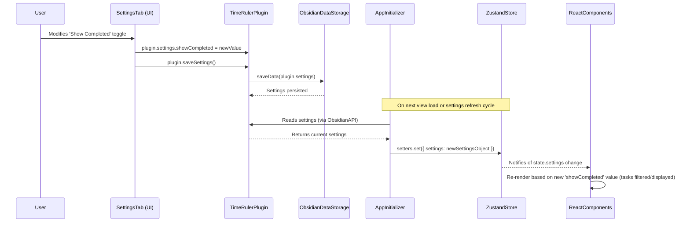
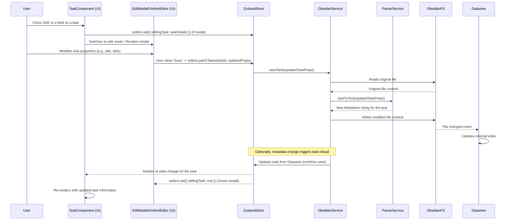
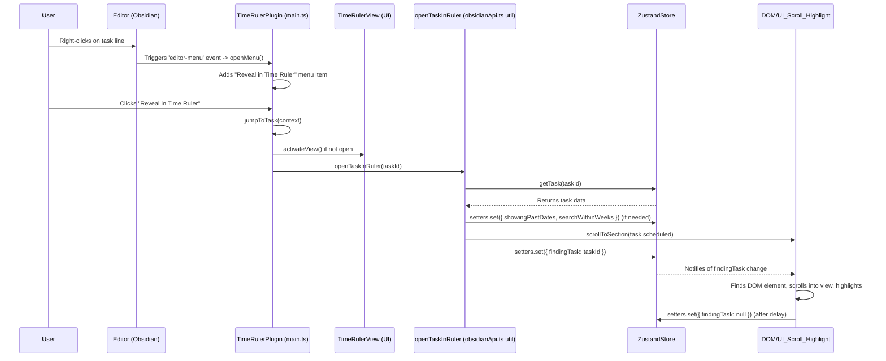

# Control Flow for Common User Interactions

This document outlines the typical control flow for several common user interactions within the Time Ruler plugin. It references relevant components, services, and store interactions.

## 1. Opening the Time Ruler View

1.  **User Action**:
    *   Clicks the ribbon icon.
    *   Executes an "Open Time Ruler" command (e.g., via command palette).

2.  **Plugin Class (`TimeRulerPlugin` in `src/main.ts`)**:
    *   The command handler or ribbon icon callback calls `plugin.activateView(openInMainSetting)`.
    *   `activateView()`:
        *   Checks if the Dataview plugin is available and initialized. Shows a notice if not.
        *   Detaches any existing Time Ruler view leaves.
        *   Gets a new workspace leaf (either main pane or sidebar based on `openInMainSetting`).
        *   Sets the view state of this leaf to `TIME_RULER_VIEW` (the registered custom view type). This triggers Obsidian to mount the view.
        *   Reveals the leaf.

3.  **View Rendering (React)**:
    *   Obsidian instantiates `TimeRulerView` (from `src/index.tsx`), which is the root for the React-based UI.
    *   `TimeRulerView` likely renders the main `App` component (`src/components/App.tsx`).
    *   **`App.tsx` - Initialization**:
        *   `useEffect` calls `reload()`.
        *   `reload()`:
            *   Initializes API service instances (`ObsidianAPI`, `CalendarAPI`) and stores them in the Zustand store (`setters.set({ apis })`).
            *   Loads plugin settings into the store (`setters.set({ settings, dailyNoteInfo })`).
            *   Calls `apis.calendar.loadEvents()`:
                *   **`CalendarAPI` (`src/services/calendarApi.ts`)**: Fetches and parses ICS calendar feeds, processes events (including recurrences), and updates the store (`setters.set({ events })`).
            *   Calls `apis.obsidian.loadTasks('', showingPastDates)`:
                *   **`ObsidianAPI` (`src/services/obsidianApi.ts`)**: Uses Dataview to query tasks from the vault based on current settings and date ranges, processes them into `TaskProps`, updates `fileOrder` setting, and updates the store (`setters.set({ tasks, fileOrder })`).
        *   The `App` component and its children then render the UI based on the data in the Zustand store (tasks, events, settings).
        *   `useEffect` in `App.tsx` scrolls to the "today" section.

## 2. Scheduling a Task (Drag & Drop Existing Task)

1.  **User Action**: Clicks and drags a `Task` component (`src/components/Task.tsx`) within the Time Ruler UI.

2.  **Drag Start (`@dnd-kit/core`)**:
    *   The `useDraggable` hook in `Task.tsx` initiates the drag.
    *   **`onDragStart` (in `src/services/dragging.ts`)**:
        *   Called by `DndContext` (likely in `App.tsx`).
        *   Sets the `dragData` in the Zustand store (`setters.set({ dragData: activeDragItemData })`) with the `TaskProps` of the dragged task and `dragType: 'task'`.
    *   `App.tsx` might render a `DragOverlay` with a representation of the dragged task.
    *   `useAutoScroll` hook (in `App.tsx` via `src/services/autoScroll.ts`) activates, enabling auto-scrolling if the user drags near the edges of scrollable areas marked with `data-auto-scroll`.

3.  **Dragging Over a Target**:
    *   User drags the task over a droppable area, e.g., a `Time` slot in `Minutes.tsx` or the header of a `Day.tsx` component.
    *   **`Droppable` Component (`src/components/Droppable.tsx`)**:
        *   The `useDroppable` hook within the target component detects the hover.
        *   `isOver` state becomes true, potentially changing the background of the droppable area (e.g., `!bg-selection` class).
    *   If dragging over a `Time` slot (for task length adjustment, if `dragData.dragType` was 'task-length'), the `Time` component's `useEffect` might update `dragData.end` in the store.

4.  **Drag End (Drop)**:
    *   User releases the mouse button.
    *   **`onDragEnd` (in `src/services/dragging.ts`)**:
        *   Called by `DndContext`.
        *   Retrieves `dragData` (the dragged task) and `dropData` (from the droppable target, e.g., `{ scheduled: "YYYY-MM-DDTHH:MM" }`).
        *   If `dragData.dragType === 'task'` and `dropData` contains scheduling info:
            *   Calls `setters.patchTasks([draggedTask.id], newScheduleData)`.
            *   **`setters.patchTasks` (in `src/app/store.ts`)**:
                *   Merges the new schedule data with the existing task data.
                *   Calls `getters.getObsidianAPI().saveTask(updatedTask)`.
                *   **`ObsidianAPI.saveTask()`**: Modifies the Markdown file to reflect the updated task information (e.g., changes/adds `[scheduled:: YYYY-MM-DDTHH:MM]` or Tasks emoji). This triggers a Dataview update.
        *   Clears `dragData` in the store (`setters.set({ dragData: null })`).

5.  **Store Update & Re-render**:
    *   The `ObsidianAPI.saveTask()` causes a file change.
    *   **`ObsidianAPI.onload()`**: The `dataview:metadata-change` event listener is triggered.
    *   Calls `obsidianAPI.loadTasks(changedFilePath, showingPastDates)` for the affected file.
    *   `loadTasks` re-queries Dataview and calls `updateTasks`.
    *   `updateTasks` updates the `tasks` object in the Zustand store.
    *   Components subscribed to `state.tasks` (e.g., `Day`, `Block`, `Group`, `Task`) re-render to show the task in its new position/state.

## 3. Creating a New Task

### A. Via Dragging the "+" Button

1.  **User Action**: Drags the "new task" `Button` (from `NewTask.tsx`) onto a droppable time slot (e.g., a `Time` component in `Minutes.tsx`).
2.  **Drag Start**:
    *   `useDraggable` in `NewTask.tsx` initiates drag. `dragData` is `{ dragType: 'new_button' }`.
    *   `onDragStart` sets this in the store.
3.  **Drag End (Drop on Time Slot)**:
    *   `onDragEnd` in `dragging.ts` is called.
    *   `dragData.dragType === 'new_button'`, `dropData` has `{ scheduled: "ISO_TIME" }`.
    *   Calls `setters.set({ newTask: { task: { scheduled: dropData.scheduled }, type: 'new' } })`.
4.  **New Task Modal (`NewTask.tsx`)**:
    *   The change in `state.newTask` causes the modal in `NewTask.tsx` to become visible.
    *   The `scheduled` time from the drop is pre-filled in the `newTask.task` data.
    *   User types a title, optionally selects a file/heading using `NewTaskHeading` components.
    *   User clicks "check" button or a `NewTaskHeading`.
5.  **Task Creation**:
    *   The click handler in `NewTask.tsx` (for check button) or `NewTaskHeading.tsx` calls `getters.getObsidianAPI().createNewTask(newTaskData.task, selectedPath, dailyNoteInfo)`.
    *   **`ObsidianAPI.createNewTask()`**:
        *   Determines the final file path (daily note or selected file).
        *   Calls `obsidianAPI.createTaskInPath()`.
        *   **`ObsidianAPI.createTaskInPath()`**:
            *   Uses `findPosition()` to determine where in the file to insert the new task. `findPosition()` may create the file if it doesn't exist (using `createFileFromPath()`).
            *   Constructs a full `TaskProps` object for the new task.
            *   Calls `obsidianAPI.saveTask(newTaskObject, true)`.
            *   **`ObsidianAPI.saveTask()`**: Inserts the new task line (formatted by `parser.taskToText`) into the file.
            *   Calls `openTask(newTaskObject)` to potentially focus the new task in an editor.
            *   Clears `newTask` from the store (`setters.set({ newTask: undefined })`), closing the modal.
6.  **Store Update & Re-render**: Similar to scheduling an existing task, the file change triggers Dataview, which updates the store, leading to UI re-render.

### B. Via Clicking the "+" Button

1.  **User Action**: Clicks the "new task" `Button` in `NewTask.tsx`.
2.  **`NewTask.tsx`**:
    *   The `onMouseDown` and subsequent `onMouseUp` (if no drag occurred) handler calls `setters.set({ newTask: { task: { scheduled: undefined }, type: 'new' } })`.
3.  **New Task Modal**: The flow proceeds as in step 4 of "Via Dragging the "+" Button", but `newTaskData.task.scheduled` is initially undefined. The user might fill it or it's determined by the chosen file (e.g., daily note).

## 4. Searching for a Task

1.  **User Action**: Clicks a search icon or triggers a search command.
2.  **Store Update**: An action sets `searchStatus: true` in the Zustand store (`setters.set({ searchStatus: true })`). This is likely initiated from a `Button` click handler in `App.tsx` or a similar global UI component.
3.  **`Search.tsx` Component**:
    *   The `Search` component is conditionally rendered (likely in `App.tsx`) when `state.searchStatus` is true.
    *   It renders as a modal using `createPortal`.
    *   `useEffect` focuses the search input field.
4.  **User Input**:
    *   User types into the search `input`.
    *   `onChange` handler updates the local `search` state within `Search.tsx`.
    *   The component re-filters `allTasks` (derived from `state.tasks` and memoized) based on the new `search` term, producing `foundTasks`. The filtering logic matches the search term against task title, path, tags, notes, priority, and status. Results are sorted by relevance.
    *   The list of `foundTasks` is re-rendered in the modal.
5.  **User Selection**:
    *   **Click**: User clicks on a task in the `foundTasks` list.
        *   The `onClick` handler calls `openTaskInRuler(task.id)` (from `obsidianApi.ts`).
        *   Calls `setters.set({ searchStatus: false })` to close the search modal.
    *   **Enter Key**: User presses Enter.
        *   `onKeyDown` handler checks if `foundTasks` is not empty.
        *   Calls `openTaskInRuler(foundTasks[0][1].id)` for the first result.
        *   Calls `setters.set({ searchStatus: false })`.
    *   **Escape Key**: User presses Escape.
        *   `onKeyDown` handler calls `setters.set({ searchStatus: false })`.
6.  **`openTaskInRuler(id: string)` (in `src/services/obsidianApi.ts`)**:
    *   Retrieves the task from the store using `getters.getTask(id)`.
    *   Adjusts `showingPastDates` and `searchWithinWeeks` in the store if the task's scheduled date is outside the current view, to ensure it becomes visible.
    *   Calls `scrollToSection()` (from `util.ts`) to scroll the main Time Ruler view to the task's date section.
    *   Uses a retry mechanism to find the task's DOM element (`[data-id="${id}"]`).
    *   Scrolls the specific task element into view and briefly highlights it.
    *   Clears `findingTask` in the store.

These flows illustrate the reactive nature of the plugin, where user actions often lead to store updates, which in turn trigger service calls (especially `ObsidianAPI` for file system changes), followed by further store updates based on those changes, and finally, UI re-renders to reflect the new state.

---

## 5. Changing a Plugin Setting

This flow describes changing a setting like "Show Completed Tasks" or "24 Hour Format".

1.  **User Action**:
    *   Opens the Obsidian settings.
    *   Navigates to the "Time Ruler" plugin settings tab.
    *   Interacts with a setting control (e.g., toggles the "Show Completed Tasks" switch).

2.  **Settings UI (`SettingsTab` in `src/plugin/SettingsTab.tsx`)**:
    *   The `onChange` handler for the specific setting control (e.g., a `Toggle` component) is triggered.
    *   Inside the handler:
        *   `this.plugin.settings.showCompleted = value;` (the new value of the toggle is assigned).
        *   `this.plugin.saveSettings();` is called.

3.  **Plugin Class (`TimeRulerPlugin` in `src/main.ts`)**:
    *   `saveSettings()`: This method calls `this.saveData(this.settings)`.
    *   Obsidian's plugin API handles saving the `this.settings` object (which now contains the modified `showCompleted` value) to the plugin's `data.json` file in the vault's configuration directory.

4.  **UI Update (Reactive via Store)**:
    *   Although the setting is saved, the Time Ruler view itself needs to react to this change. This typically happens when the view is next reloaded or when settings are explicitly propagated to the store.
    *   **View Reload / Settings Propagation**:
        *   When the Time Ruler view is active, the `ObsidianAPI` instance (in `src/services/obsidianApi.ts`) holds a reference to the plugin settings.
        *   The `AppInitializer` component (or a similar mechanism in `App.tsx`) is responsible for reading settings from `ObsidianAPI` (which gets them from `plugin.settings`) and putting them into the Zustand store.
        *   `AppInitializer`'s `reload` function (called on initial load and potentially on other events) would execute:
            *   `const settings = { muted: apis.obsidian.getSetting('muted'), ... };` (collects all relevant settings).
            *   `setters.set({ settings });` to update the settings object within the Zustand store.
    *   **Component Re-render**:
        *   React components within `App.tsx` (e.g., `TimelineView`, `Day`, `Task`) are subscribed to the `settings` part of the Zustand store (e.g., `useAppStore(state => state.settings.showCompleted)`).
        *   When the `settings.showCompleted` value changes in the store, these components automatically re-render.
        *   For example, if `showCompleted` is true, tasks that are marked as complete will now be visible. If false, they will be filtered out from rendering. The filtering logic is often within selectors or directly in the rendering map functions of components like `Day.tsx` or `Group.tsx`.

### Mermaid Diagram: Changing a Plugin Setting

---

## 6. Editing an Existing Task (e.g., Changing Title or Date via UI)

This flow assumes there's a UI mechanism to edit a task's properties directly within the Time Ruler view, potentially by clicking on a task to bring up a modal or inline editing fields.

1.  **User Action**:
    *   Clicks on a specific field of a `Task` component (e.g., the task title, a date field).
    *   Alternatively, clicks an "edit" button on a task.

2.  **React Component (`Task.tsx` or a dedicated Edit Modal Component)**:
    *   The click handler is triggered.
    *   This might set some local component state to switch to "edit mode" (e.g., replacing text with an input field).
    *   Or, it might set state in the Zustand store to open a centralized edit modal, passing the task's ID: `setters.set({ editingTask: { id: task.id, ...taskData } })`.

3.  **User Input**:
    *   User modifies the task's properties in the input field(s) or modal.
    *   For example, changes the task title, or updates a date using a date picker.

4.  **Saving Changes**:
    *   User clicks a "Save" button or blurs an input field.
    *   The component's event handler for this action is triggered.
    *   It collects the modified task data.
    *   It calls `setters.patchTasks([taskId], { title: newTitle, scheduled: newScheduledDate, ... })`.

5.  **Store & Persistence (`setters.patchTasks` in `src/app/store.ts`)**:
    *   Merges the new/updated properties with the existing task data for the given `taskId`.
    *   Calls `getters.getObsidianAPI().saveTask(updatedTaskProps)`.
    *   **`ObsidianAPI.saveTask()` (`src/services/obsidianApi.ts`)**:
        *   Reads the Markdown file containing the task.
        *   Uses `parser.ts` (`taskToText`) to convert the `updatedTaskProps` back into its Markdown string representation. This is crucial to correctly format any changed dates, title, or other metadata.
        *   Replaces the old task line in the file content with the new task line.
        *   Writes the modified content back to the Markdown file using Obsidian's API.
    *   The local store state for the task is updated (this might happen optimistically before or after `saveTask`).
    *   If a modal was used, it's closed by clearing the `editingTask` state: `setters.set({ editingTask: null })`.

6.  **Dataview & UI Refresh**:
    *   The file modification by `ObsidianAPI.saveTask()` is detected by Dataview.
    *   Dataview updates its index.
    *   If `ObsidianAPI` has a listener for `dataview:metadata-change` (as seen in other flows), it might trigger `obsidianAPI.loadTasks()` for the specific file. This ensures the store has the canonical version of the task post-save.
    *   React components subscribed to this task in the Zustand store re-render to display the updated information.

### Mermaid Diagram: Editing an Existing Task

---

## 7. Revealing a Task in Time Ruler from Editor Context Menu

This flow describes how a task viewed in a Markdown editor can be located and shown within the Time Ruler plugin.

1.  **User Action**:
    *   User is viewing/editing a Markdown file in Obsidian.
    *   User right-clicks on a line that represents a task.
    *   Selects "Reveal in Time Ruler" from the editor context menu.

2.  **Plugin Setup (`TimeRulerPlugin` in `src/main.ts` - `onload`)**:
    *   During plugin initialization, an event listener for the editor menu is registered:
        `this.app.workspace.on('editor-menu', (menu, _, context) => this.openMenu(menu, context))`

3.  **Context Menu Population (`openMenu` in `src/main.ts`)**:
    *   When the user right-clicks in an editor, the `openMenu` method is called.
    *   It checks if the cursor is on a line that looks like a task (`/ *- \[ \] /`).
    *   If it is, it adds an item to the menu:
        `menu.addItem((item) => item.setIcon('ruler').setTitle('Reveal in Time Ruler').onClick(() => this.jumpToTask(context)))`

4.  **User Clicks Menu Item**:
    *   The `onClick` handler calls `this.jumpToTask(context)`.
    *   `context` is `MarkdownView | MarkdownFileInfo`.

5.  **`jumpToTask(context)` Method (`src/main.ts`)**:
    *   Ensures `context.file` and `context.editor` are available.
    *   Gets the current file path and cursor line number.
    *   Validates that the current line is indeed a task. If not, shows a `Notice`.
    *   **Activate/Reveal View**:
        *   Checks if the Time Ruler view (`TIME_RULER_VIEW`) is already open: `this.app.workspace.getLeavesOfType(TIME_RULER_VIEW)?.[0]`.
        *   If not open, it calls `this.activateView()` to open the Time Ruler.
        *   If open but not active, it calls `this.app.workspace.revealLeaf(leaf)` to bring it to the forefront.
    *   **Triggering Task Reveal in UI**:
        *   Calls `openTaskInRuler(path + '::' + cursor.line)`. Note: `openTaskInRuler` is imported from `src/services/obsidianApi.ts` but is actually a function that directly interacts with the store and UI scrolling, not part of the `ObsidianAPI` class typically. It seems to be a utility function within that file, possibly exposed for this specific purpose.

6.  **`openTaskInRuler(id: string)` (utility in `src/services/obsidianApi.ts`)**:
    *   `id` is a composite ID like `filePath::lineNumber`.
    *   Retrieves the task from the Zustand store: `const task = getters.getTask(id)`.
    *   **Date Adjustments (if necessary)**:
        *   If the task's scheduled date is in the past and `showingPastDates` is false, it updates `setters.set({ showingPastDates: true })`.
        *   If the task's scheduled date is outside the current `searchWithinWeeks` range, it expands the range: `setters.set({ searchWithinWeeks: newRange })`. This ensures the task's date range becomes visible.
    *   Calls `scrollToSection(task.scheduled)` (from `src/services/util.ts`):
        *   This function likely scrolls the main timeline view (`#time-ruler-times > div`) to the correct date section based on the task's scheduled date.
    *   **Highlighting the Task**:
        *   Sets `setters.set({ findingTask: id })` to indicate which task is being sought.
        *   A `useEffect` hook likely in `Task.tsx` or `TimelineView.tsx` observes `findingTask`. When it matches a task's ID:
            *   The task's DOM element (`document.querySelector(\`[data-id="\${id}"]\`)`) is scrolled into view using `element.scrollIntoView()`.
            *   A temporary highlight class might be added to the task element.
            *   `setters.set({ findingTask: null })` is called after a short delay to remove the highlight or clear the state.

7.  **UI Update**:
    *   The Time Ruler view (if not already open) appears.
    *   The view scrolls to the section containing the task.
    *   The specific task is scrolled into view and briefly highlighted.

### Mermaid Diagram: Revealing Task from Editor

